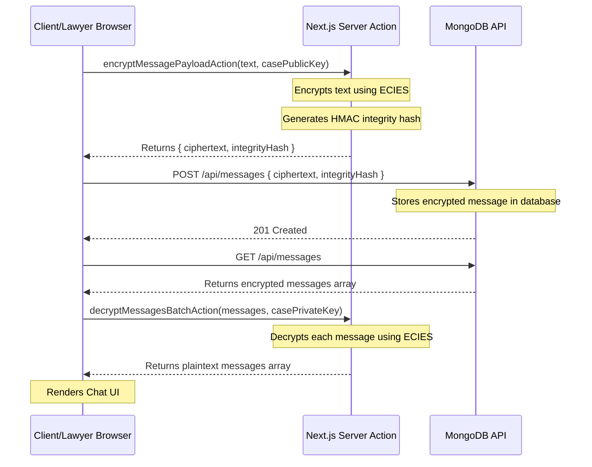
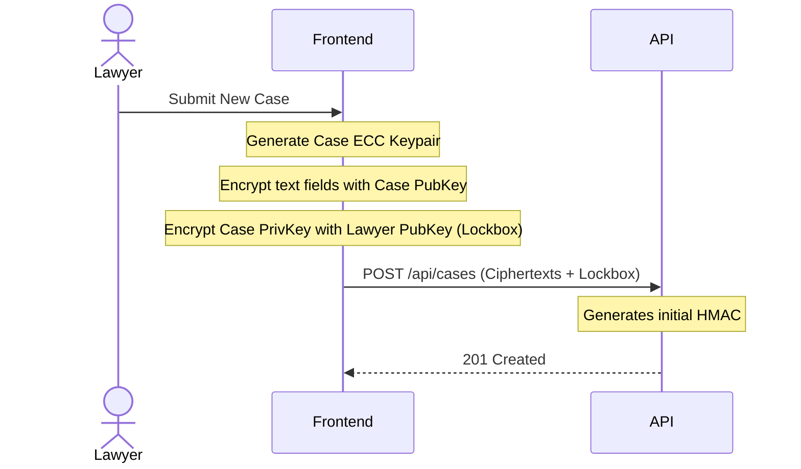
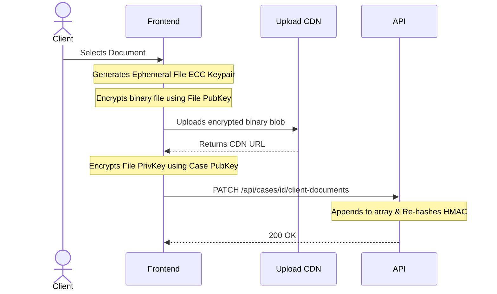
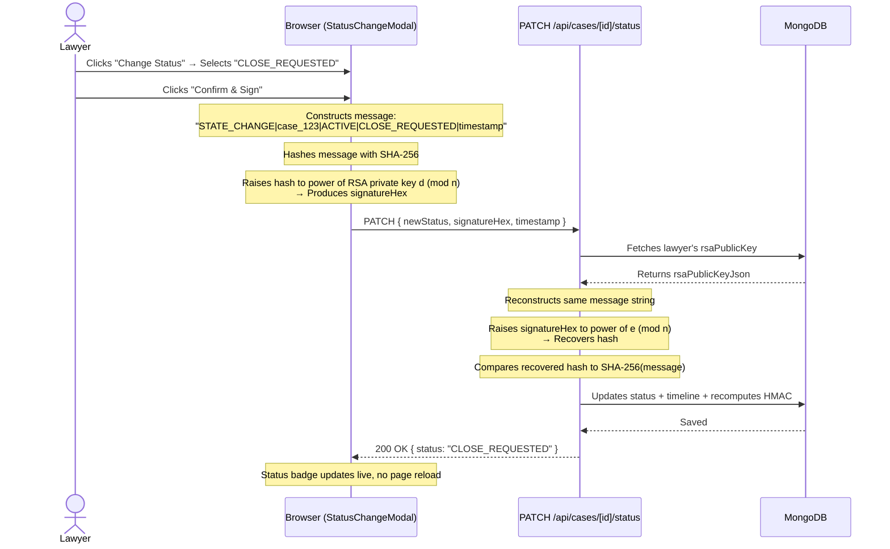

# Counsel: Technical Documentation & Cryptography Architecture

## Table of Contents
- [Overview](#overview)
- [1. Cryptographic Primitives & Algorithms](#1-cryptographic-primitives--algorithms)
  - [A. Elliptic Curve Cryptography (secp256k1)](#a-elliptic-curve-cryptography-secp256k1)
  - [B. RSA (Rivest–Shamir–Adleman)](#b-rsa-rivestshamiradleman)
- [2. System Workflows (Users, Cases, and Assignments)](#2-system-workflows-users-cases-and-assignments)
  - [A. User Creation (Clients & Lawyers)](#a-user-creation-clients--lawyers)
  - [B. Case Creation](#b-case-creation)
  - [C. Case Assignment (Lawyers & Clients)](#c-case-assignment-lawyers--clients)
- [3. The Secure Messaging System](#3-the-secure-messaging-system)
- [4. File Encryption (Exhibits & Client Documents)](#4-file-encryption-exhibits--client-documents)
- [5. Tamper-Evident Database (Server-Side Integrity)](#5-tamper-evident-database-server-side-integrity)
- [6. Development Guidelines](#6-development-guidelines)
- [7. Frontend Dashboards & Task Workflows](#7-frontend-dashboards--task-workflows)
- [8. Step-by-Step Data Flow (For Beginners)](#8-step-by-step-data-flow-for-beginners)
- [9. Step-by-Step File Upload & Retrieval Flow (For Beginners)](#9-step-by-step-file-upload--retrieval-flow-for-beginners)
- [10. RSA Non-Repudiation: Case Status Change Flow](#10-rsa-non-repudiation-case-status-change-flow)
  - [A. The Lawyer Dashboard (`/lawyer/`)](#a-the-lawyer-dashboard-lawyer)
  - [B. The Client Dashboard (`/client/`)](#b-the-client-dashboard-client)

---

## Overview
Counsel is a secure, encrypted case management system for law firms and their clients. The system is built with Next.js and strictly adheres to high-security cryptographic requirements, ensuring that all sensitive data is encrypted at rest and in transit.

---

## 1. Cryptographic Primitives & Algorithms
Per strict requirements, **all asymmetric encryption algorithms were implemented from scratch** without relying on high-level external crypto libraries like libsodium.

### A. Elliptic Curve Cryptography (secp256k1)
- **Algorithm:** ECIES (Elliptic Curve Integrated Encryption Scheme)
- **How it works:** A random ephemeral key pair is generated. A shared secret is derived using ECDH between the ephemeral private key and the recipient's public key. The shared secret is hashed to derive a symmetric keystream. The plaintext is XOR'd with the keystream and a MAC is appended.

**Code Example (`ecc.ts`):**
```typescript
export function encrypt(plaintext: string, recipientPublicKey: string): ECIESCiphertext {
  const Q = decodePoint(recipientPublicKey);
  const plaintextBuf = Buffer.from(plaintext, 'utf8');

  // Step 1: generate ephemeral keypair (r, R=r*G)
  const r = generateRandomScalar();
  const R = scalarMultiply(r, G);

  // Step 2: derive shared secret S = r * Q_recipient
  const S = scalarMultiply(r, Q);

  // Step 3: derive MAC and Cipher keys
  const macKey = deriveMacKey(S);
  const keystream = deriveKeystream(S, plaintextBuf.length);

  // Step 4: XOR keystream with plaintext
  // ... returns { ephemeralPublicKey, ciphertext, mac }
}
```

### B. RSA (Rivest–Shamir–Adleman)
- **Purpose:** Digital Signatures for non-repudiation of critical actions (e.g., Case State Transitions).

**Code Example (`stateVerification.ts`):**
```typescript
export async function signStateTransition(
  caseId: string, oldState: string, newState: string, privateKey: RSAPrivateKey
) {
  const timestamp = Date.now();
  const message = `STATE_CHANGE|${caseId}|${oldState}|${newState}|${timestamp}`;
  const signatureHex = await sign(message, privateKey);
  return { signatureHex, timestamp };
}
```

---

## 2. System Workflows (Users, Cases, and Assignments)

The platform has strict workflows to ensure keys are distributed securely across the role-based hierarchy (Clients, Lawyers, Admins).

### A. User Creation (Clients & Lawyers)
Users are created via `POST /api/auth/register/route.ts`. During registration, the system:
1. Generates an **ECC Keypair** (for data encryption).
2. Generates an **RSA Keypair** (for digital signatures).
3. Encrypts the user's Personally Identifiable Information (PII) — like `email`, `username`, and `contact` — using their own **ECC Public Key**.
4. Hashes the user's password using a custom PBKDF2 algorithm.

```typescript
// Inside register/route.ts
const eccKeyPair = generateECCKeyPair();
const rsaKeyPair = generateRSAKeyPair(1024);

// PII is immediately encrypted
const username_enc = JSON.stringify(encryptECIES(username, eccKeyPair.publicKey));

const newUser = new User({
  username_enc,
  passwordHash,
  publicKey: eccKeyPair.publicKey,
  encryptedPrivateKey: eccKeyPair.privateKey, // Stored encrypted by login password
  rsaPublicKey: JSON.stringify(rsaKeyPair.publicKey),
  rsaPrivateKey: rsaKeyPair.privateKey.d,
  role: 'client' // or 'lawyer'
});
```

### B. Case Creation
Cases are created by authorized personnel via `POST /api/cases`.
1. The frontend generates a unique **Case ECC Keypair**.
2. All case text fields (Title, Description) are encrypted **in the browser** using the Case Public Key.
3. The Case Private Key is encrypted into an **Access Key Lockbox**. It is encrypted using the creator's personal ECC Public Key, ensuring the creator retains access.

```typescript
// The Access Key structure passed to the API
const accessKeys = [
  {
    userId: currentUserId,
    encryptedCaseKey: encryptECIES(casePrivateKeyHex, userPublicKey)
  }
];
```

### C. Case Assignment (Lawyers & Clients)
When a Lawyer is assigned to a case (`POST /api/cases/[id]/assign`), or a Client is attached to a case (`POST /api/cases/[id]/client`), the server cannot simply give them the Case Private Key because it is encrypted!

**The Workflow:**
1. The assigning Admin/Lawyer retrieves the Target User's (Lawyer/Client) Public ECC Key.
2. The assigning Admin/Lawyer decrypts the Case Private Key locally using their own keys.
3. They re-encrypt the Case Private Key using the Target User's Public ECC Key.
4. This new encrypted bundle is appended to the `accessKeys` array on the Case document.

This ensures the server never sees the raw Case Private Key, preserving True End-to-End Encryption (E2EE).

---

## 3. The Secure Messaging System

Counsel includes a real-time, E2EE chat system tied to each case. Messages are encrypted using the Case's keys, ensuring only assigned lawyers and the specific client can read them.

### Architecture Diagram


### Code Example: Message Encryption (Server Actions)
To offload heavy ECC math from the client browser, encryption and decryption are routed through Next.js Server Actions (`src/app/actions/messageCryptoActions.ts`).

```typescript
export async function encryptMessagePayloadAction(text: string, casePublicKey: string) {
  // 1. Encrypt message for the case
  const bundle: ECIESCiphertext = encrypt(text, casePublicKey);
  const ciphertext = JSON.stringify(bundle);

  // 2. Generate HMAC to prevent message tampering in transit/at rest
  const integrityHash = generateHMAC('client-integrity-key', ciphertext);

  return { ok: true, ciphertext, integrityHash };
}
```

---

## 4. File Encryption (Exhibits & Client Documents)
Per strict system requirements, **symmetric encryption (e.g., AES) is completely banned**.

Even large binary files are encrypted strictly using **Asymmetric ECIES**:
1. A fresh, ephemeral **ECC Keypair** is generated specifically for the uploaded file.
2. The binary file is hex-encoded and passed directly into the custom **ECIES** function.
3. The file's ephemeral **ECC Private Key** is stored in the database alongside the File URL.

**Code Example (`fileCrypto.ts`):**
```typescript
export function encryptFileECIES(fileBuffer: Uint8Array, recipientPublicKey: string) {
  // Encode binary as hex so the ECIES string path can handle it losslessly.
  const hexEncoded = Buffer.from(fileBuffer).toString('hex');
  return encrypt(hexEncoded, recipientPublicKey);
}
```

---

## 5. Tamper-Evident Database (Server-Side Integrity)

To ensure that no one (not even someone with direct database access) can silently alter a case, the API enforces a strict HMAC check.

1. **Generation:** Whenever a case is legally modified via `PATCH /api/cases/[id]`, the server concatenates all critical encrypted fields.
2. **Signing:** The server hashes this massive string using a secret `SERVER_SECRET` (HMAC-SHA256) and stores the resulting hash in the case's `hmac` field.
3. **Verification:** On `GET /api/cases/[id]`, the server re-calculates the HMAC based on the fetched fields. If the HMACs do not match, a **500 Tamper Detected** error is thrown.

**Code Example (`api/cases/[id]/route.ts`):**
```typescript
const hmacPayload = [
  caseDoc.clientId,
  caseDoc.title_enc,
  // ... all other _enc fields
  caseDoc.clientDocuments_enc || ''
].join('|');

const isIntact = verifyHMAC(secret, hmacPayload, caseDoc.hmac);

if (!isIntact) {
  throw new Error("Data integrity validation failed (Tamper Detected)");
}
```

---

## 6. Development Guidelines
- **Adding New Fields:** If you add a new `_enc` field to a Case, you **MUST** update the `hmacPayload` array in `src/app/api/cases/[id]/route.ts`. Failure to do so will result in a compromised tamper-evidence chain. Always maintain a legacy fallback array for existing records.
- **Browser Compatibility:** When working with cryptography in Next.js Client Components, remember that Node's `crypto` module is unavailable.
- **Modifying Crypto:** Core cryptography files in `src/lib/crypto/` are written from scratch based on RFC specifications. Any modifications require rigorous unit testing against known-answer vectors. Do not introduce standard high-level libraries (e.g., `crypto-js`), as this violates the project's foundational constraints.

---

## 7. Frontend Dashboards & Task Workflows

The frontend consists of role-based routing (`/lawyer/` and `/client/` directories). The separation ensures that UI features map strictly to the authorized permissions of the underlying API routes.

### A. The Lawyer Dashboard (`/lawyer/`)
Lawyers have full control over the cases they manage. The core tasks available in their dashboard include:

#### 1. Creating a New Case (`/cases/new`)
When a lawyer creates a new case, the system must establish the cryptographic boundaries for that case.
- **Data Flow:**
  1. The Lawyer fills out the case metadata in plaintext.
  2. The frontend generates a fresh **ECC Keypair** exclusively for this new case by calling `generateKeyPair()` from `src/lib/crypto/ecc.ts`.
     - *Deep Dive:* This function uses cryptographically secure random bytes to generate a 256-bit scalar `d`. It ensures `d` is within the valid range of the secp256k1 curve (greater than 0 and less than the curve order `N`). It then performs Elliptic Curve scalar multiplication (`d * G`) to derive the Public Key point `Q`, returning both as hex strings.
     - **Code Example (`src/lib/crypto/ecc.ts`):**
       ```typescript
       export function generateKeyPair(): ECCKeyPair {
         let d: bigint;
         do {
           // Generate 32 bytes (256 bits) of cryptographic randomness
           d = BigInt(`0x${crypto.randomBytes(32).toString('hex')}`);
         } while (d === 0n || d >= N); // Ensure valid scalar within curve order N
       
         // Derive Public Key Q by multiplying private scalar d with Generator Point G
         const Q = scalarMultiply(d, G);
       
         return {
           privateKey: d.toString(16).padStart(64, '0'),
           publicKey: encodePoint(Q),
         };
       }
       ```
  3. The frontend encrypts all text fields using this new **Case Public Key**. It calls `encrypt(text, caseKeyPair.publicKey)` which uses ECIES.
  4. The frontend fetches the Lawyer's personal ECC Public Key and encrypts the **Case Private Key**, creating the first `accessKey` lockbox.
  5. The encrypted fields and the lockbox are sent to `POST /api/cases`.



**Code Example (`new-case-form.tsx`):**
```typescript
async function handleSubmit(e: React.FormEvent) {
  // 1. Fetch public keys
  const [adminKeysRes, myKeyRes] = await Promise.all([
    fetch('/api/admin/public-keys'), fetch('/api/user/me/public-key')
  ]);

  // 2. Generate a per-case ECC keypair
  const caseKeyPair = generateKeyPair();

  // 3. Encrypt the Case Private Key for authorized users (Access Keys)
  const accessKeys = [];
  accessKeys.push({
    userId: myKeyJson.data.userId,
    encryptedCaseKey: JSON.stringify(encrypt(caseKeyPair.privateKey, myECCPublicKey)),
  });

  // 4. Encrypt all case fields using ECIES
  const encField = (val: string) => JSON.stringify(encrypt(val, caseKeyPair.publicKey));
  const payload = {
    casePublicKey: caseKeyPair.publicKey,
    title_enc: encField(formData.title),
    description_enc: encField(formData.description),
    accessKeys,
  };

  // 5. Submit to backend
  await fetch('/api/cases', { method: 'POST', body: JSON.stringify(payload) });
}
```

#### 2. Managing Exhibits (`/cases/[id]`)
Lawyers can upload physical/digital evidence logs.
- **Data Flow:**
  1. The Lawyer clicks "Log New Exhibit".
  2. If a file is attached, the browser generates an **Ephemeral File ECC Keypair** by calling `generateFileKeyPair()` (an alias of `generateKeyPair()` from `ecc.ts`).
  3. The file is hex-encoded and encrypted asymmetrically using the File Public Key by calling `encryptFileECIES()` from `src/lib/crypto/fileCrypto.ts`.
     - *Deep Dive:* The binary file is read as a `Uint8Array`, converted to a hex string, and passed directly into the core `encrypt()` function. Because the ECC math expects string payloads, the hex encoding ensures lossless binary round-tripping without requiring AES.
     - **Code Example (`src/lib/crypto/fileCrypto.ts`):**
       ```typescript
       export function encryptFileECIES(fileBuffer: Uint8Array, recipientPublicKey: string) {
         // Hex encode binary to safely pass through the ECIES string path
         const hexEncoded = Buffer.from(fileBuffer).toString('hex');
         return encrypt(hexEncoded, recipientPublicKey);
       }
       ```
  4. The encrypted file is sent to the storage bucket.
  5. The File Private Key is encrypted using the **Case Public Key** and stored in the database alongside the Exhibit text metadata.

**Code Example (`EncryptedExhibitUpload.tsx`):**
```typescript
const handleFileChange = async (e: React.ChangeEvent<HTMLInputElement>) => {
  const file = e.target.files?.[0];
  const fileKeyPair = generateFileKeyPair(); // ECC Keypair

  const arrayBuffer = await file.arrayBuffer();
  const fileBytes = new Uint8Array(arrayBuffer);

  // Encrypt binary to ECIES payload
  const bundle = encryptFileECIES(fileBytes, fileKeyPair.publicKey);
  const bundleJson = JSON.stringify(bundle);
  const encodedBlob = new Blob([bundleJson], { type: 'application/octet-stream' });
  const encryptedFile = new File([encodedBlob], file.name);

  // Store the File Private Key to send to DB
  currentKeyPayload.current = JSON.stringify({
    filePrivateKey: fileKeyPair.privateKey,
  });

  await startUpload([encryptedFile]);
}
```

#### 3. State Transitions & RSA Signing (`/cases/[id]`)
Lawyers can change the status of a case. This requires **Non-Repudiation**.
- **Data Flow:**
  1. The browser constructs a structured transition message.
  2. The browser prompts for the lawyer's **RSA Private Key**.
  3. The transition message is digitally signed.
  4. The API verifies the RSA signature using the Lawyer's public key.

---

### B. The Client Dashboard (`/client/`)
Clients have a restricted view. They can only see cases assigned to them and can only write to specific scoped fields (like Client Documents and Messages).

#### 1. Viewing Case Details (`/cases/[id]`)
When a client loads their case, the system must unpack the encryption seamlessly.
- **Data Flow:**
  1. `GET /api/cases/[id]` fetches the encrypted case data.
  2. The client's browser searches the `accessKeys` array for their specific lockbox.
  3. The browser uses the Client's personal ECC Private Key to decrypt the lockbox, extracting the **Case Private Key**.
  4. The browser uses the Case Private Key to decrypt all `_enc` fields on the page.

#### 2. Uploading Client Documents (`/cases/[id]`)
Clients need a secure way to send sensitive documents to their lawyer without having write-access to the entire case document.
- **Data Flow:**
  1. The Client selects a document.
  2. The browser generates an **Ephemeral File ECC Keypair**.
  3. The file is ECIES-encrypted with the File Public Key and uploaded to the CDN.
  4. The API receives the payload via `PATCH /api/cases/[id]/client-documents`, updates the array, and re-calculates the case HMAC.



#### 3. Profile & Settings (`/profile`, `/settings`)
User PII (email, phone, name) is encrypted using their personal ECC Public Key. When rendering the profile page, the browser decrypts this on the fly.
In settings, users can enable TOTP. The server generates a secret, and the frontend displays a QR code. Verification requires entering the time-based code generated by the standard `totp.ts` primitive.

---


## 8. Step-by-Step Data Flow

**The Scenario:** A lawyer changes the description of a case to `"The client is innocent."`

### Step 1: The User Types Data (Frontend)
The user types `"The client is innocent."` into a React input field inside `client-documents-tab.tsx` (or the case edit form). Right now, this text only exists in the browser's temporary memory.

### Step 2: Fetching the Key (Frontend)
Before we can save this text, we must lock it. To lock it, the browser needs the **Case Public Key**. Think of the Public Key as an open padlock that anyone can snap shut, but only the person with the matching Private Key can open.

**Where does the Case Public Key come from?**
1. When the case was originally created, a unique ECC Keypair was generated for it.
2. The Public half of that keypair (`casePublicKey`) was saved to MongoDB in **plaintext**, because public keys are safe to share.
3. When the lawyer navigated to this case's page, their browser made a `GET` request to `/api/cases/[id]`.
4. The server returned the Case document, and the React component stored it in its local state.

```typescript
// Inside the React Component, we read the key from the fetched case data
const plainText = "The client is innocent.";

// This was loaded into the page state via GET /api/cases/[id]
const casePublicKey = currentCase.casePublicKey;
// Looks like: "04a1b2c3d4..." (A 130-character hex string representing an uncompressed ECC point)
```

### Step 3: Encryption (Frontend)
The browser takes the `plainText` and the `casePublicKey` and runs it through our custom ECIES algorithm. This turns the readable text into an unreadable scrambled mess (a JSON bundle containing the ciphertext).

```typescript
import { encrypt } from '@/lib/crypto/ecc';

// The text is scrambled using the open padlock
const encryptedBundle = encrypt(plainText, casePublicKey);

// We turn the bundle into a string so it can be sent over the internet
const description_enc = JSON.stringify(encryptedBundle);
// Result: '{"ephemeralPublicKey":"04ff..","ciphertext":"a8b9..","mac":"c1d2.."}'
```

### Step 4: Sending to the Database (Network)
The frontend makes an HTTP request to the backend server. **Notice that the plaintext `"The client is innocent."` is never sent over the internet.** Only the scrambled string is sent.

```typescript
await fetch(`/api/cases/${caseId}`, {
  method: 'PATCH',
  headers: { 'Content-Type': 'application/json' },
  body: JSON.stringify({
    description_enc: description_enc
  })
});
```

### Step 5: Storing & Tamper-Proofing (Backend)
The Next.js API receives the scrambled text. **The server has no idea what the text says** because it doesn't have the Private Key.
Before saving it to MongoDB, the server creates a cryptographic "wax seal" (HMAC) over the scrambled text to ensure no hacker alters the database directly.

```typescript
// Inside api/cases/[id]/route.ts

// 1. The server receives the scrambled string
caseDoc.description_enc = body.description_enc;

// 2. The server creates a wax seal (HMAC) over all the data
const payloadToSeal = `${caseDoc.title_enc}|${caseDoc.description_enc}`;
caseDoc.hmac = generateHMAC(process.env.SERVER_SECRET, payloadToSeal);

// 3. Save to MongoDB
await caseDoc.save();
```

### Step 6: Fetching the Data Later (Backend to Frontend)
Days later, the lawyer logs back in and opens the case page. The browser asks the server for the case data via `GET /api/cases/[id]`.
The server checks if the "wax seal" (HMAC) is broken. If it's intact, it sends the scrambled string back to the browser.

```typescript
// Inside the browser, we receive the scrambled string
const scrambledDescription = fetchedCase.description_enc;
```

### Step 7: Unlocking the Lockbox (Frontend)
Before the browser can decrypt the text, it needs the **Case Private Key**.
**Where does the Case Private Key come from?**
1. The `fetchedCase` object contains an array called `accessKeys`. This is a list of "Lockboxes".
2. One of these lockboxes belongs to the lawyer. It contains the Case Private Key, but it is encrypted by the *Lawyer's* personal ECC Public Key.
3. The browser uses the lawyer's personal ECC Private Key (which was decrypted into browser memory when they logged in) to open their specific lockbox.

```typescript
// The browser opens the lockbox to get the Case Private Key
const casePrivateKey = unlockCaseKeyForUser(
  fetchedCase.accessKeys,
  lawyerPersonalPrivateKey // Held in local React state/context since login
);
```

### Step 8: Decryption (Frontend)
Finally, the browser passes the scrambled string and the newly unlocked Case Private Key into the decryption function. The math runs in reverse, and the original text appears on the screen!

```typescript
import { decrypt } from '@/lib/crypto/ecc';

// Parse the scrambled string back into a bundle
const bundle = JSON.parse(scrambledDescription);

// Unlock the text using the Case Private Key
const result = decrypt(bundle, casePrivateKey);

if (result.ok) {
  console.log(result.plaintext);
  // Outputs: "The client is innocent."
} else {
  console.error("The message was tampered with!");
}
```

By keeping the encryption and decryption strictly in Steps 3 and 8 (in the user's browser), we achieve True End-to-End Encryption (E2EE). The server (Steps 4-6) is entirely blind to the contents of the case!

---

## 9. Step-by-Step File Upload & Retrieval Flow

Encrypting huge binary files (like PDFs or JPEGs) requires a slightly different approach than encrypting a short text string. Here is exactly what happens when a user uploads a file, and how another user safely retrieves it.

**The Scenario:** A client wants to upload a sensitive document: `id_card.pdf`.

### Step 1: Selecting the File (Frontend)
The client clicks the "Attach File" button and selects `id_card.pdf` from their computer. The file is loaded into the browser's memory as a raw stream of binary bytes (a `Uint8Array`).

### Step 2: Generating a File-Specific Padlock (Frontend)
For maximum security, we do not encrypt the file using the Case's keys directly. Instead, the browser generates a brand new, one-time-use **Ephemeral File ECC Keypair** exclusively for this specific file.

```typescript
import { generateFileKeyPair } from '@/lib/crypto/fileCrypto';

// Generates a brand new ECC Keypair just for id_card.pdf
const fileKeyPair = generateFileKeyPair();
// fileKeyPair.publicKey (The open padlock)
// fileKeyPair.privateKey (The key to open it)
```

### Step 3: Encrypting the Binary File (Frontend)
The browser takes the raw binary bytes of `id_card.pdf` and converts them into a hex string so the cryptography algorithm can read it. It then encrypts the hex string using the new **File Public Key**. 

```typescript
import { encryptFileECIES } from '@/lib/crypto/fileCrypto';

// Read the file from the HTML input
const arrayBuffer = await file.arrayBuffer();
const fileBytes = new Uint8Array(arrayBuffer);

// Scramble the file using the File Public Key
const encryptedBundle = encryptFileECIES(fileBytes, fileKeyPair.publicKey);

// Convert the scrambled JSON bundle back into a binary Blob for uploading
const bundleJson = JSON.stringify(encryptedBundle);
const encodedBlob = new Blob([bundleJson], { type: 'application/octet-stream' });
const encryptedFile = new File([encodedBlob], "encrypted_exhibit.bin");
```

### Step 4: Uploading to the Cloud (Network)
The browser uploads the scrambled `encryptedFile` to our cloud storage provider (UploadThing CDN). 
**Notice:** The cloud provider only receives a scrambled mess of bytes. If the cloud provider is hacked, the hacker only gets useless, encrypted binary blobs.
The cloud provider returns a public link to the scrambled file: `fileUrl`.

### Step 5: Securing the File's Key (Frontend)
We now have a scrambled file on the internet, but how do we save the **File Private Key** so authorized users can unlock it later? 
We encrypt the File Private Key using the **Case Public Key**. This ensures that anyone who has access to the Case can also decrypt the file.

```typescript
// Grab the Case Public Key from the React component's state
const casePublicKey = currentCase.casePublicKey;

// Lock the File Private Key inside the Case's padlock
const encryptedFilePrivateKey = encrypt(fileKeyPair.privateKey, casePublicKey);
```

### Step 6: Saving the Metadata (Backend)
The frontend sends an API request to the backend containing the CDN link and the locked file key. The server saves this in the database and creates an HMAC "wax seal" over it to prevent tampering.

```typescript
// The payload sent to PATCH /api/cases/[id]/client-documents
{
  fileUrl: "https://uploadthing.com/f/encrypted_blob_xyz",
  fileKey: JSON.stringify(encryptedFilePrivateKey),
  fileName: "id_card.pdf" // Stored to know what to name the file when downloading
}
```

### Step 7: Retrieving and Decrypting (Frontend)
Days later, the lawyer clicks the "Download" button next to `id_card.pdf`. Here is how the browser reverses the process:

**1. Unlocking the Case Private Key:** 
As explained in Section 8, the lawyer's browser has already used their personal key to unlock the **Case Private Key**.

**2. Unlocking the File Private Key:** 
The browser takes the scrambled `fileKey` from the database and decrypts it using the **Case Private Key**.
```typescript
// 1. Recover the File Private Key
const decryptedFileKeyResult = decrypt(JSON.parse(exhibit.fileKey), casePrivateKey);
const filePrivateKey = decryptedFileKeyResult.plaintext;
```

**3. Downloading and Decrypting the File:**
The browser downloads the scrambled blob from the `fileUrl`, parses it back into an ECIES bundle, and decrypts it using the newly recovered **File Private Key**.

```typescript
// 2. Download the scrambled blob from the cloud
const response = await fetch(exhibit.fileUrl);
const blob = await response.blob();
const bundleJson = await blob.text();
const bundle = JSON.parse(bundleJson);

// 3. Decrypt the blob into the original binary bytes
const decryptResult = decryptFileECIES(bundle, filePrivateKey);

if (decryptResult.ok) {
  const originalBinaryBytes = decryptResult.data;
  
  // 4. Trigger a download to the Lawyer's hard drive
  const fileBlob = new Blob([originalBinaryBytes], { type: 'application/octet-stream' });
  const objectUrl = URL.createObjectURL(fileBlob);
  
  const link = document.createElement('a');
  link.href = objectUrl;
  link.download = exhibit.fileName; // "id_card.pdf"
  link.click();
}
```

And just like that, the original `id_card.pdf` is safely saved to the lawyer's computer without the server or the CDN ever seeing a single pixel of the document!

---

## 10. RSA Non-Repudiation: Case Status Change Flow

This section documents the complete implementation of the RSA-backed case status change feature. It is the primary use-case of the RSA algorithm in this project and enforces **Non-Repudiation** — making it mathematically impossible for a lawyer to deny that they authorized a critical legal action.

### What is Non-Repudiation?
Non-repudiation means that once an action has been taken, the actor cannot later claim they did not take it. In the legal domain, this is critical: if a lawyer closes a case and later disputes it, the system can produce an RSA digital signature that **only their private key could have generated**. This is cryptographic proof.

### Architecture Overview



---

### State Machine (Valid Transitions)
Not all status transitions are legal. The backend enforces the following case lifecycle:

| From Status      | Allowed Next Status(es)             |
|------------------|--------------------------------------|
| `PENDING_REVIEW` | `ACTIVE`, `REJECTED`                 |
| `ACTIVE`         | `CLOSE_REQUESTED`                    |
| `CLOSE_REQUESTED`| `CLOSED`, `ACTIVE` (reopen)          |
| `CLOSED`         | *(terminal — no transitions allowed)*|
| `REJECTED`       | *(terminal — no transitions allowed)*|

```typescript
// From src/app/api/cases/[id]/status/route.ts
const ALLOWED_TRANSITIONS: Partial<Record<CaseStatus, readonly CaseStatus[]>> = {
  PENDING_REVIEW: ['ACTIVE', 'REJECTED'],
  ACTIVE: ['CLOSE_REQUESTED'],
  CLOSE_REQUESTED: ['CLOSED', 'ACTIVE'],
};
```

---

### Step 1: The Trigger (Frontend — `StatusChangeModal.tsx`)
The lawyer navigates to a case's Overview tab. Next to the Status badge, a **"Change Status"** button is rendered. This button only appears if `rsaPrivateKeyHex` is passed as a prop (lawyers only; clients never receive this prop so the button is invisible to them).

Clicking opens the modal. The modal's dropdown only shows the valid next states for the current status, preventing illegal transitions from even being attempted.

---

### Step 2: RSA Signing in the Browser
When the lawyer clicks **"Confirm & Sign"**, the browser executes the following entirely locally, without any network call:

```typescript
// Inside StatusChangeModal.tsx — handleConfirm()

// 1. Reconstruct the RSA Private Key from the stored hex scalars
const rsaPublicKey = JSON.parse(rsaPublicKeyJson);  // Parses stored { e, n }
const rsaPrivateKey: RSAPrivateKey = {
  d: rsaPrivateKeyHex,  // The private exponent scalar (from DB)
  n: rsaPublicKey.n,    // The shared modulus
};

// 2. Call the stateVerification utility — this performs the RSA math
const { signatureHex, timestamp } = await signStateTransition(
  caseId,          // e.g. "CASE-001"
  currentStatus,   // e.g. "ACTIVE"
  selectedStatus,  // e.g. "CLOSE_REQUESTED"
  rsaPrivateKey,
);
```

Inside `signStateTransition()` in `src/lib/crypto/stateVerification.ts`:

```typescript
export async function signStateTransition(
  caseId: string, oldState: string, newState: string, privateKey: RSAPrivateKey
): Promise<{ signatureHex: string; timestamp: number }> {
  const timestamp = Date.now();

  // Construct the canonical message string — must match exactly what the server verifies
  const message = `STATE_CHANGE|${caseId}|${oldState}|${newState}|${timestamp}`;

  // RSA-sign the message: Hash it with SHA-256, then raise hash^d mod n
  const signatureHex = await sign(message, privateKey);

  return { signatureHex, timestamp };
}
```

And inside `sign()` in `src/lib/crypto/rsa.ts`:

```typescript
export async function sign(message: string, privateKey: RSAPrivateKey): Promise<string> {
  // 1. Hash the message with SHA-256 to get a fixed-length digest
  const hashBuffer = await crypto.subtle.digest('SHA-256', new TextEncoder().encode(message));
  const hashHex = Array.from(new Uint8Array(hashBuffer))
    .map(b => b.toString(16).padStart(2, '0')).join('');

  // 2. Treat the hash as a BigInt
  const hBig = BigInt('0x' + hashHex);
  const d = BigInt('0x' + privateKey.d);
  const n = BigInt('0x' + privateKey.n);

  // 3. RSA Signature: S = H^d mod n
  //    Only Alice (with her private d) can produce this specific S.
  return modExp(hBig, d, n).toString(16);
}
```

---

### Step 3: Sending the Signed Request (Network)
The browser sends a `PATCH` request to the dedicated status endpoint. **The lawyer's private key never leaves the browser.** Only the output signature is sent.

```typescript
const res = await fetch(`/api/cases/${caseMongoId}/status`, {
  method: 'PATCH',
  headers: { 'Content-Type': 'application/json' },
  body: JSON.stringify({
    newStatus: 'CLOSE_REQUESTED',
    signatureHex: '4f8a9b2c...', // The RSA signature
    timestamp: 1725667200000,    // Used to reconstruct the exact message server-side
  }),
});
```

---

### Step 4: Server-Side RSA Verification (Backend — `status/route.ts`)
The `PATCH /api/cases/[id]/status` API handler performs the following in sequence:

**1. Validate the requested transition is legal:**
```typescript
const currentStatus = caseDoc.status as CaseStatus; // e.g. "ACTIVE"
const allowed = ALLOWED_TRANSITIONS[currentStatus] ?? [];

if (!allowed.includes(newStatus)) {
  return NextResponse.json({ error: 'Transition not permitted' }, { status: 422 });
}
```

**2. Fetch the lawyer's RSA Public Key from MongoDB:**
```typescript
const user = await User.findById(userId);
const rsaPublicKey: RSAPublicKey = JSON.parse(user.rsaPublicKey);
// rsaPublicKey = { e: "10001", n: "c4a9..." }
```

**3. Verify the RSA signature:**
```typescript
const isValid = await verifyStateTransition(
  caseId,          // "CASE-001"
  currentStatus,   // "ACTIVE"
  newStatus,       // "CLOSE_REQUESTED"
  timestamp,       // 1725667200000
  signatureHex,    // "4f8a9b2c..."
  rsaPublicKey,    // The lawyer's public key from MongoDB
);
```

Inside `verifyStateTransition()` in `src/lib/crypto/stateVerification.ts`:

```typescript
export async function verifyStateTransition(
  caseId: string, oldState: string, newState: string,
  timestamp: number, signatureHex: string, publicKey: RSAPublicKey
): Promise<boolean> {
  // Reconstruct the exact same canonical message that was signed
  const message = `STATE_CHANGE|${caseId}|${oldState}|${newState}|${timestamp}`;
  return await verify(message, signatureHex, publicKey);
}
```

Inside `verify()` in `src/lib/crypto/rsa.ts`:

```typescript
export async function verify(
  message: string, signatureHex: string, publicKey: RSAPublicKey
): Promise<boolean> {
  // 1. Hash the received message independently
  const hashBuffer = await crypto.subtle.digest('SHA-256', new TextEncoder().encode(message));
  const expected = BigInt('0x' + toHex(hashBuffer));

  // 2. RSA Verify: recover the hash by raising the signature to e mod n
  //    Mathematically reverses the signing: S^e mod n = (H^d)^e mod n = H mod n
  const e = BigInt('0x' + publicKey.e);
  const n = BigInt('0x' + publicKey.n);
  const s = BigInt('0x' + signatureHex);
  const recovered = modExp(s, e, n);

  // 3. If recovered hash === expected hash, the signature is authentic
  return expected === recovered;
}
```

**4. If the signature fails:** Log to the audit trail and return 403 Forbidden:
```typescript
if (!isValid) {
  await appendEntry(userId, 'CASE_STATUS_SIGNATURE_INVALID',
    `Invalid RSA signature for ${currentStatus}→${newStatus} on case ${caseId}`);
  return NextResponse.json({ error: 'RSA signature verification failed.' }, { status: 403 });
}
```

**5. If the signature is valid:** Update the status, append to timeline, and recompute the HMAC:
```typescript
caseDoc.status = newStatus;
caseDoc.timeline.push({ action: `Status changed from ${currentStatus} to ${newStatus}`, actorId: userId });

// Re-seal the HMAC to maintain tamper-evidence after the update
const hmacPayload = [caseDoc.clientId, caseDoc.title_enc, /* ...all _enc fields */].join('|');
caseDoc.hmac = generateHMAC(process.env.SERVER_SECRET, hmacPayload);
await caseDoc.save();

await appendEntry(userId, 'CASE_STATUS_CHANGED',
  `Changed case ${caseId} from ${currentStatus} to ${newStatus} (RSA-signed)`);
```

---

### Step 5: Live Badge Update (Frontend)
Upon receiving a `200 OK`, the `onSuccess` callback is fired with the new status string. Because the status is managed by `useState` inside `OverviewTab`, the badge updates **instantly and in-place** without triggering a full page reload:

```typescript
// Inside OverviewTab — status is local React state
const [status, setStatus] = useState<CaseStatus>(initialStatus);

// ...passed to the modal as:
<StatusChangeModal
  onSuccess={(newStatus) => setStatus(newStatus)}
/>
```

The badge color, label, and available transitions in the dropdown all automatically react to the new state value.

